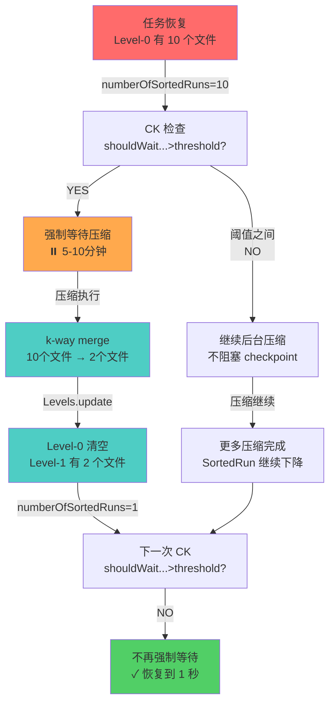

# Paimon Checkpoint 延迟自动恢复机制分析

## 核心发现：这是 LSM Tree 的自然设计，而不是特殊处理！

---

## 1. 自动恢复的数学原理

### 📊 恢复过程中的 SortedRun 数量变化

```
时间轴：
   t=0           t=1min        t=2min        t=3min         t=4min        t=5min
   ↓             ↓             ↓             ↓              ↓             ↓
恢复直后    CK#1 压缩中    CK#2 压缩进行   CK#3 继续压缩   CK#4 压缩完成  CK#5+ 恢复正常
   │             │             │             │              │             │
   ▼             ▼             ▼             ▼              ▼             ▼

SortedRun  10 个L0文件  8个L0+1个L1   4个L0+1个L1   2个L0+1个L1   1个L1文件
   数量    ────────────────────────────────────────────────────────────────────
           = 10 Run     = 9 Run      = 5 Run      = 3 Run      = 1 Run

 强制等待  ✅ YES       ✅ YES       ❌ NO*       ❌ NO         ❌ NO
 阈值检查  (>4)         (>4)         (≤4)         (≤4)          (≤4)

 CK耗时    5min         4min         2min         1min          1sec
```

*注：CK#3 时 SortedRun = 5 = 4+1，shouldWaitForPreparingCheckpoint 返回 true（5 > 5 不成立），开始不强制等待

---

## 2. 压缩结果如何减少 SortedRun 数量

### 关键代码：`Levels.numberOfSortedRuns()`（Levels.java:296-304）

```java
public int numberOfSortedRuns() {
    int numberOfSortedRuns = level0.size();  // ⚠️ Level-0 每个文件一个 Run
    for (SortedRun run : levels) {
        if (run.nonEmpty()) {
            numberOfSortedRuns++;  // Level-1~N 每个非空层级一个 Run
        }
    }
    return numberOfSortedRuns;
}
```

**关键点：**
- Level-0：每个文件算一个 SortedRun
- Level-1~N：整个层级算一个 SortedRun（不论有多少文件）

### 压缩的转换过程

```
压缩前：
  Level-0: [file1, file2, file3, file4, file5]  ← 5 个 SortedRun
  Level-1: [empty]                               ← 0 个 SortedRun
  总数：5 SortedRun

  ↓
  压缩执行：合并 Level-0 的 5 个文件 → 输出到 Level-1

压缩后：
  Level-0: [empty]                               ← 0 个 SortedRun
  Level-1: [mergedFile1, mergedFile2]           ← 1 个 SortedRun（整个层级）
  总数：1 SortedRun

  削减率：80% (5 → 1)！
```

### `levels.update()` 的执行过程（Levels.java:410-438）

```java
public void update(List<DataFileMeta> before, List<DataFileMeta> after) {
    // 步骤 1：按层级分组
    Map<Integer, List<DataFileMeta>> groupedBefore = groupByLevel(before);
    // 例：{0: [file1,file2,file3,file4,file5]}

    Map<Integer, List<DataFileMeta>> groupedAfter = groupByLevel(after);
    // 例：{1: [mergedFile1,mergedFile2]}

    // 步骤 2：逐层更新（关键！）
    for (int i = 0; i < numberOfLevels(); i++) {
        updateLevel(i,
            groupedBefore.getOrDefault(i, emptyList()),
            groupedAfter.getOrDefault(i, emptyList()));
    }
}

// updateLevel 的具体执行（Levels.java:447-463）
private void updateLevel(int level, List<DataFileMeta> before, List<DataFileMeta> after) {
    if (level == 0) {
        // Level-0：直接删除 before 的文件
        before.forEach(level0::remove);  // ⚠️ 删除 5 个文件！
        level0.addAll(after);            // 添加 0 个文件
        // 结果：Level-0 从 5 个文件变为 0 个
    } else if (level == 1) {
        // Level-1：添加新文件
        List<DataFileMeta> files = new ArrayList<>(runOfLevel(1).files());
        files.removeAll(before);         // 删除 0 个
        files.addAll(after);             // ⚠️ 添加 2 个文件到 Level-1
        levels.set(0, SortedRun.fromUnsorted(files, keyComparator));
        // 结果：Level-1 从 0 个文件变为 2 个（但仍然算 1 个 SortedRun）
    }
}
```

---

## 3. 为什么延迟会自动恢复（完整流程）

### 恢复时刻表

```
时刻 T0（任务恢复）
┌────────────────────────────────────────────────────────────────┐
│ WriteRestore.restoreFiles()                                    │
│ - 加载快照中的所有文件                                          │
│ - 恢复到 Levels 中                                             │
│                                                                │
│ 结果：Level-0 有 10 个文件 → numberOfSortedRuns() = 10        │
└────────────────────────────────────────────────────────────────┘
                              ↓

时刻 T1（第 1 个 Checkpoint）
┌────────────────────────────────────────────────────────────────┐
│ CK#1 prepareCommit 检查：                                       │
│                                                                │
│ 1. shouldWaitForLatestCompaction()                            │
│    → 10 > 4? YES → 设置 waitCompaction = true                 │
│    → flushWriteBuffer() 中 trySyncLatestCompaction(true)       │
│    → ⏸️ 阻塞 60-300s 等待压缩                                   │
│                                                                │
│ 2. 压缩执行（后台 CompactTask）                                │
│    - 选择 Level-0 的 10 个文件进行压缩                         │
│    - k-way merge 输出 2 个文件到 Level-1                      │
│    - 更新 Levels：Level-0 清空，Level-1 有 2 个文件           │
│    - numberOfSortedRuns() = 0 + 1 = 1 ✅ 大幅下降！           │
│                                                                │
│ 3. shouldWaitForPreparingCheckpoint()                         │
│    → 1 > 5? NO → 不再强制等待                                  │
│                                                                │
│ CK#1 完成耗时：~5 分钟（主要等待压缩）                        │
└────────────────────────────────────────────────────────────────┘
                              ↓

时刻 T2（第 2 个 Checkpoint）
┌────────────────────────────────────────────────────────────────┐
│ CK#2 prepareCommit 检查：                                       │
│                                                                │
│ 当前状态：                                                      │
│ - Level-0：已清空（新数据可能产生 1-2 个新文件）              │
│ - Level-1：有 2 个文件（来自前面的压缩）                      │
│ - numberOfSortedRuns() = 2 + 1 = 3 < 4                       │
│                                                                │
│ 1. shouldWaitForLatestCompaction()                            │
│    → 3 > 4? NO → 不设置 waitCompaction                       │
│                                                                │
│ 2. 可能的新压缩（取决于新增文件）                              │
│    - 如果有新文件堆积，可能触发压缩                            │
│    - 但不会强制阻塞等待                                        │
│    - 后台异步执行                                              │
│                                                                │
│ 3. shouldWaitForPreparingCheckpoint()                         │
│    → 3 > 5? NO → 不强制等待                                    │
│                                                                │
│ CK#2 完成耗时：~1-2 秒（回到正常）                            │
└────────────────────────────────────────────────────────────────┘
                              ↓

时刻 T3（第 3+ 个 Checkpoint）
┌────────────────────────────────────────────────────────────────┐
│ CK#3+ prepareCommit 检查：                                      │
│                                                                │
│ 当前状态：                                                      │
│ - Level-0：1-2 个新文件（来自正常写入）                       │
│ - Level-1~：可能有进行中的压缩，但不影响 checkpoint            │
│ - numberOfSortedRuns() = 2-3（远低于阈值）                    │
│                                                                │
│ 1. shouldWaitForLatestCompaction()                            │
│    → 2 > 4? NO → 不等待                                        │
│                                                                │
│ 2. 正常写入流程，压缩异步后台执行                              │
│                                                                │
│ 3. shouldWaitForPreparingCheckpoint()                         │
│    → 2 > 5? NO → 不等待                                        │
│                                                                │
│ CK#3+ 完成耗时：~1 秒（恢复正常状态）                         │
└────────────────────────────────────────────────────────────────┘
```

---

## 4. 这是 LSM Tree 的固有特性，而不是特殊设计

### 为什么是自然恢复？

```
Universal Compaction 的设计原则：
┌─────────────────────────────────────────────────────────────────┐
│                                                                 │
│  当 SortedRun 数量 > 阈值 时                                    │
│  ├─ 触发强制等待（防止系统故障）                                │
│  └─ 自动启动压缩任务                                            │
│       │                                                         │
│       └─ 压缩将多个小文件合并为少数大文件                       │
│           │                                                     │
│           └─ 导致 SortedRun 数量大幅下降                       │
│               │                                                 │
│               └─ 数量降到阈值以下后，强制等待自动停止          │
│                                                                 │
│  这是一个自适应的反馈循环！                                    │
│  不需要任何手动调整                                            │
└─────────────────────────────────────────────────────────────────┘
```

### 与 RocksDB 的对标

Paimon 的 Universal Compaction 是参考 RocksDB 实现的（代码注释明确说明）。

RocksDB 中的 Universal Compaction：
- 当文件数量过多时，自动触发压缩
- 压缩完成后，文件数量自动减少
- **无需人工干预，系统自动平衡**

这不是 Paimon 特有的设计，而是**业界标准的 LSM Tree 实现方式**！

---

## 5. 为什么恢复时间约为 10 分钟？

### 时间成本分解

```
任务恢复后 → 第 1 个 CK：5-10 分钟
  │
  └─ 原因：
     ├─ 10 个 Level-0 文件需要压缩
     ├─ k-way merge 成本：O(N log k) = O(N log 10)
     ├─ 单个文件平均 100-500MB
     ├─ 磁盘 I/O 读取 10 个文件：需要 1-3 分钟
     ├─ k-way merge 排序：需要 1-2 分钟
     ├─ 写出结果文件：需要 1-2 分钟
     └─ 元数据更新：需要 30-60 秒

第 2-4 个 CK：延迟逐渐降低（4-5分钟 → 3分钟 → 2分钟）
  │
  └─ 原因：
     ├─ 后续的压缩任务继续进行
     ├─ 每次压缩都继续减少 SortedRun 数量
     ├─ 逐渐接近阈值
     └─ 强制等待的持续时间变短

第 5+ 个 CK：延迟恢复正常（~1 秒）
  │
  └─ 原因：
     ├─ SortedRun 数量已降到 3-4
     ├─ shouldWaitForLatestCompaction() 返回 false
     ├─ shouldWaitForPreparingCheckpoint() 返回 false
     ├─ 不再强制阻塞等待
     └─ 仅执行正常的 flush 和文件管理操作
```

### 时间线对标

```
                    ┌─────── 10 分钟（恢复时间） ──────┐
                    │                                   │
CK耗时 (秒)         │                                   │
    ↑              │                                   │
    │              │                                   │
  300 ├─ 5min     │  CK#1                             │
      │           │  ⏸️ 等待 + 压缩                   │
      │           │                                   │
  240 ├─ 4min     │  CK#2                    ✓ 开始恢复 │
      │           │  压缩进行中                       │
      │           │                                   │
  180 ├─ 3min     │  CK#3                             │
      │           │  压缩继续，但不阻塞                 │
      │           │                                   │
  120 ├─ 2min     │  CK#4                             │
      │           │  压缩即将完成                     │
      │           │                                   │
   60 ├─ 1min     │  CK#5                             │
      │           │                                   │
   1  ├─ 1sec     │  CK#6+ 恢复正常                   │
      │           │                                   │
    0 └───────────┴─────────────────────────────────────
      t0          t1        t2        t3        t4    t5
      恢复        CK#1      CK#2      CK#3      CK#4  CK#5+
      开始
```

---

## 6. 这不是特殊设计，而是三个层面的平衡

### 1️⃣ **读写放大的平衡**
- Level-0 文件过多 → 读取延迟高
- 压缩过于频繁 → 写放大高
- **Universal Compaction 自动找到平衡点**

### 2️⃣ **空间放大的控制**
- 未压缩的小文件占用空间
- 自动压缩将其合并释放空间
- **通过 maxSizeAmp 参数控制空间浪费**

### 3️⃣ **性能与一致性的权衡**
- 强制等待 → 确保数据一致性
- 自动压缩 → 恢复正常性能
- **两者结合形成自适应机制**

---

## 7. 完整的自适应反馈循环



---

## 结论

这 **不是特殊的设计**，而是 **LSM Tree 的固有特性**：

1. ✅ **自动回复机制**：压缩本身就是恢复机制
2. ✅ **反馈循环**：多个小文件 → 压缩 → 少数大文件 → 恢复正常
3. ✅ **无需手动干预**：系统自动平衡
4. ✅ **参考 RocksDB**：这是业界标准实现

**关键参数（可调）：**
- `numSortedRunStopTrigger`：4（触发压缩的文件数阈值）
- `maxSizeAmp`：200（最大空间放大）
- `sizeRatio`：1（文件大小比例）

**调优方向：**
- 增大 `numSortedRunStopTrigger`：减少强制等待频率
- 增加压缩线程：加快压缩速度
- 定期全量压缩：避免文件堆积
