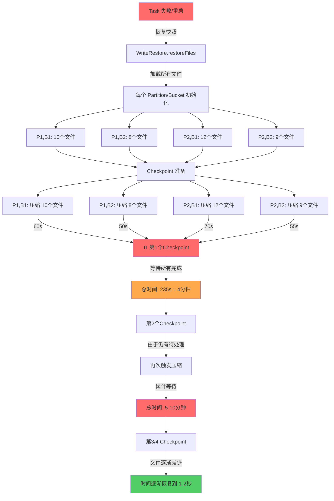
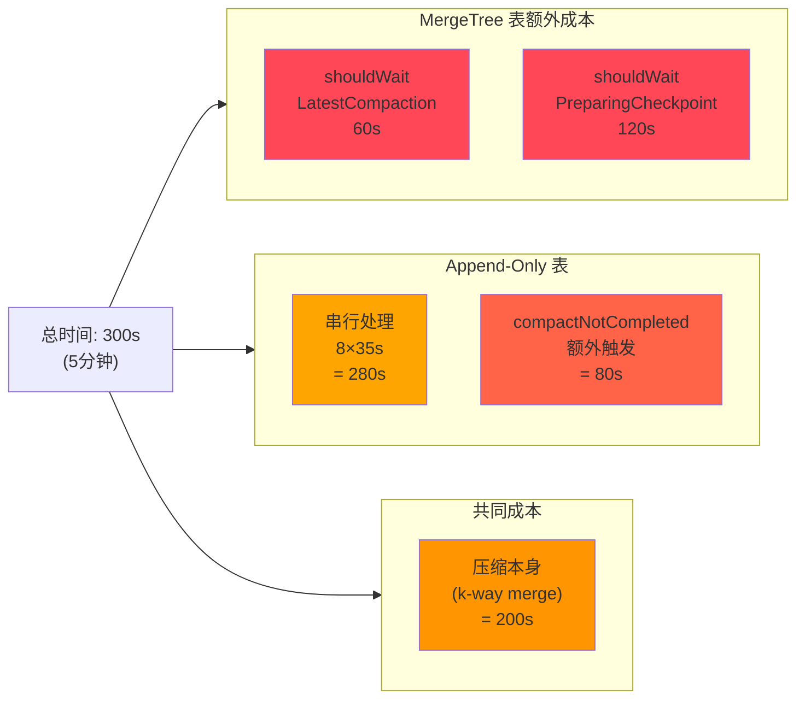
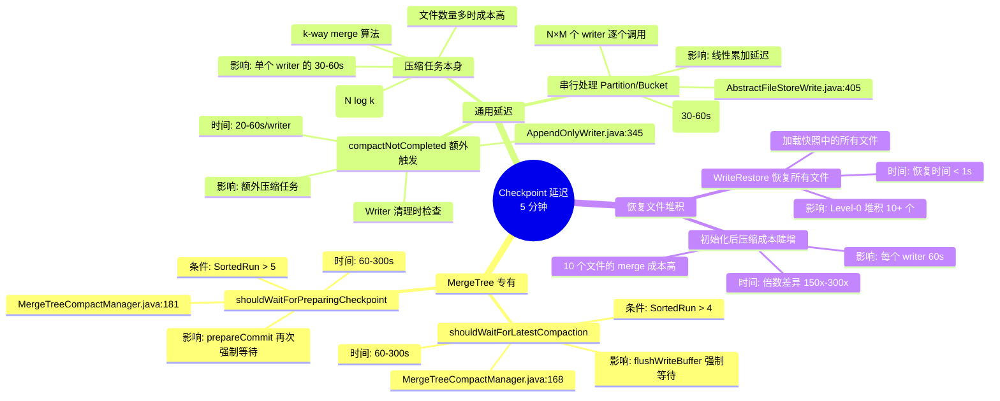
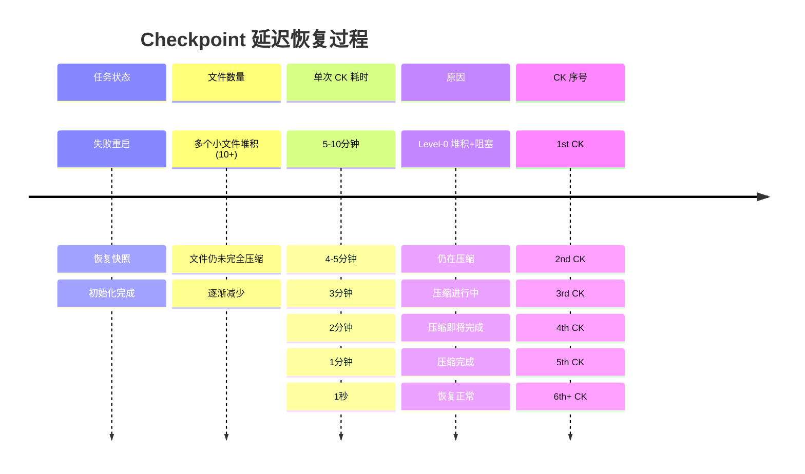

# Paimon Checkpoint 延迟 - Mermaid 时序图可视化

## 1. Primary Key 表 (MergeTree) Checkpoint 完整流程

```mermaid
sequenceDiagram
    participant FK as Flink Checkpoint
    participant STCMT as StreamTableCommit
    participant TW as TableWriteImpl
    participant AFSW as AbstractFileStoreWrite
    participant MTW as MergeTreeWriter
    participant CM as CompactManager
    participant CT as CompactTask

    FK->>STCMT: commit(checkpointId)
    activate STCMT

    STCMT->>TW: prepareCommit(waitCompaction=false, ckId)
    activate TW

    TW->>AFSW: prepareCommit(false, commitId)
    activate AFSW

    Note over AFSW: ⚠️ 嵌套循环开始 (串行处理)<br/>for each partition (P1...Pn):<br/>  for each bucket (B1...Bm):

    AFSW->>MTW: writer.prepareCommit(false)
    activate MTW

    MTW->>MTW: flushWriteBuffer(false, false)
    activate MTW

    Note over MTW: ⚠️ 第1个检查点<br/>shouldWaitForLatestCompaction()<br/>SortedRun数 > 4?

    MTW->>CM: shouldWaitForLatestCompaction()
    CM-->>MTW: true (文件堆积)
    Note over MTW: 强制设置:<br/>waitForLatestCompaction = true

    MTW->>CM: trySyncLatestCompaction(true)
    activate CM

    CM->>CM: getCompactionResult(blocking=true)

    Note over CT: ⏸️ 阻塞等待压缩<br/>(60-300s)
    CM->>CT: 等待 CompactTask 完成
    CT->>CT: k-way merge 多个文件

    Note over CT: 执行时间取决于:<br/>• 文件数量<br/>• 单个文件大小<br/>• 压缩策略

    CT-->>CM: 压缩完成，返回结果

    CM->>MTW: 结果返回
    deactivate CM

    MTW->>CM: triggerCompaction(false)
    Note over CM: 可能再次触发压缩

    deactivate MTW

    Note over MTW: ⚠️ 第2个检查点<br/>shouldWaitForPreparingCheckpoint()<br/>SortedRun数 > 5?

    MTW->>CM: shouldWaitForPreparingCheckpoint()
    CM-->>MTW: true (仍然太多文件)
    Note over MTW: 强制设置:<br/>waitCompaction = true

    MTW->>CM: trySyncLatestCompaction(true)
    activate CM

    CM->>CM: getCompactionResult(blocking=true)

    Note over CT: ⏸️ 再次阻塞等待<br/>(可能有新的压缩任务)<br/>(60-300s)
    CM->>CT: 等待可能的新压缩任务
    CT->>CT: 继续 k-way merge

    CT-->>CM: 完成

    CM->>MTW: 结果返回
    deactivate CM

    MTW->>MTW: drainIncrement()
    MTW-->>AFSW: CommitIncrement
    deactivate MTW

    Note over AFSW: ⚠️ 开始下一个循环<br/>for next partition/bucket

    AFSW->>AFSW: Writer 清理检查
    Note over AFSW: !compactNotCompleted()<br/>可能再次触发压缩

    AFSW-->>TW: List&lt;CommitMessage&gt;
    deactivate AFSW

    TW-->>STCMT: 提交消息列表
    deactivate TW

    STCMT-->>FK: Checkpoint 完成
    deactivate STCMT

    Note over FK: 总时间: 1s (正常)<br/>或 5-10分钟 (初始化后)
```

---

## 2. Append-Only 表 Checkpoint 完整流程

```mermaid
sequenceDiagram
    participant FK as Flink Checkpoint
    participant STCMT as StreamTableCommit
    participant TW as TableWriteImpl
    participant AFSW as AbstractFileStoreWrite
    participant AOW as AppendOnlyWriter
    participant CM as CompactManager
    participant CT as CompactTask

    FK->>STCMT: commit(checkpointId)
    activate STCMT

    STCMT->>TW: prepareCommit(waitCompaction=false, ckId)
    activate TW

    TW->>AFSW: prepareCommit(false, commitId)
    activate AFSW

    Note over AFSW: ⚠️ 嵌套循环开始 (串行处理)<br/>for each partition (P1...Pn): # 7 个分区<br/>  for each bucket (B1...Bm):     # 4 个 bucket<br/>    总共 28 个 writer 逐个处理

    loop 对每个 Partition/Bucket
        AFSW->>AOW: writer.prepareCommit(false)
        activate AOW

        AOW->>AOW: flush(false, false)
        activate AOW

        Note over AOW: ⚠️ 创建新文件<br/>sinkWriter.flush()

        AOW->>CM: addNewFile(file)

        AOW->>CM: trySyncLatestCompaction(false)
        activate CM

        Note over CM: 如果有待处理的压缩:<br/>getCompactionResult(blocking=false)<br/>可能立即返回或等待

        CM-->>AOW: 压缩结果 (如果有)
        deactivate CM

        AOW->>CM: triggerCompaction(false)

        deactivate AOW

        AOW->>CM: trySyncLatestCompaction(false || forceCompact)
        activate CM

        Note over CT: 如果 forceCompact=true<br/>或之前有未完成压缩:<br/>⏸️ 可能阻塞等待<br/>(30-60s)
        CM->>CT: 等待压缩完成
        CT->>CT: k-way merge (合并小文件)

        CT-->>CM: 完成
        CM-->>AOW: 结果
        deactivate CM

        AOW->>AOW: drainIncrement()

        Note over AOW: ⚠️ 返回到 AbstractFileStoreWrite<br/>进行 Writer 清理检查

        deactivate AOW

        AFSW->>AFSW: Writer 清理检查
        activate AFSW

        Note over AFSW: if (committable.isEmpty())<br/>  if (writerCleanChecker.apply())<br/>    调用: !compactNotCompleted()

        AFSW->>AOW: compactNotCompleted()
        activate AOW

        Note over AOW: ⚠️ 额外压缩触发!<br/>triggerCompaction(false)

        AOW->>CM: triggerCompaction(false)

        Note over CM: 可能产生新的压缩任务<br/>即使之前说不再有压缩了!

        CM-->>AOW: void

        AOW->>CM: compactNotCompleted()
        CM-->>AOW: boolean

        AOW-->>AFSW: boolean
        deactivate AOW

        deactivate AFSW

        AFSW-->>AOW: void (writer close 或保留)
        deactivate AOW

        Note over AFSW: ✓ 当前 partition/bucket 完成<br/>⚠️ 继续下一个循环 (串行!)
    end

    AFSW-->>TW: List&lt;CommitMessage&gt;
    deactivate AFSW

    TW-->>STCMT: 提交消息列表
    deactivate TW

    STCMT-->>FK: Checkpoint 完成
    deactivate STCMT

    Note over FK: 总时间: 1s (正常)<br/>或 5-10分钟 (初始化后)<br/>N×M 个 writer 串行执行 ⚠️
```

---

## 3. 恢复后的文件堆积导致的级联压缩



---

## 4. 时间成本分解 (初始化后)



---

## 5. 关键延迟部分代码对应



---

## 6. 关键代码行号对应

| 延迟阶段 | 文件 | 行号 | 代码片段 | 影响 |
|---------|------|------|--------|------|
| **1. 第1次阻塞** | MergeTreeWriter | 550-603 | `flushWriteBuffer(W, false)` | 60-300s |
| | MergeTreeCompactManager | 168-169 | `return levels...> numSortedRunStopTrigger` | 决定强制等待 |
| | MergeTreeWriter | 553-554 | `if (shouldWait...) W = true` | 强制等待 |
| | MergeTreeWriter | 600 | `trySyncLatestCompaction(W)` | ⏸️ 第1个阻塞点 |
| **2. 第2次阻塞** | MergeTreeWriter | 634-635 | `if (shouldWaitFor...) W = true` | 强制等待 |
| | MergeTreeWriter | 639 | `trySyncLatestCompaction(W)` | ⏸️ 第2个阻塞点 |
| **3. 串行循环** | AbstractFileStoreWrite | 393-405 | 嵌套 for 循环 | N×M×(30-60s) |
| | AbstractFileStoreWrite | 405 | `increment = writer.prepareCommit(W)` | 逐个调用 |
| **4. 额外触发** | AbstractFileStoreWrite | 485 | `!writer.compactNotCompleted()` | 额外 20-60s |
| | AppendOnlyWriter | 345 | `triggerCompaction(false)` | 再次触发 |

---

## 7. 恢复过程中的变化


