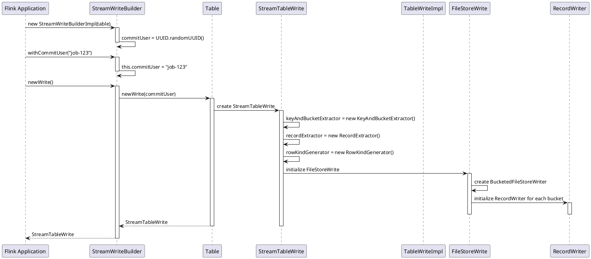
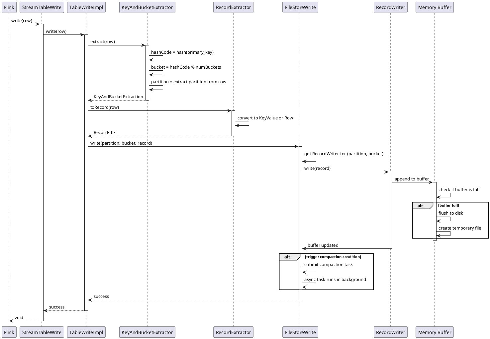
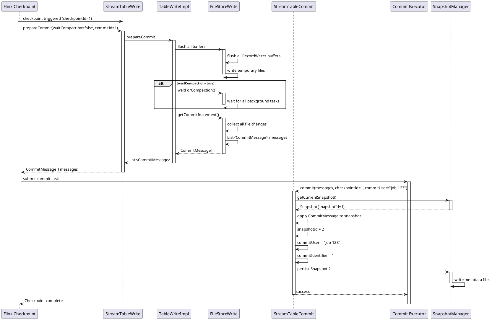
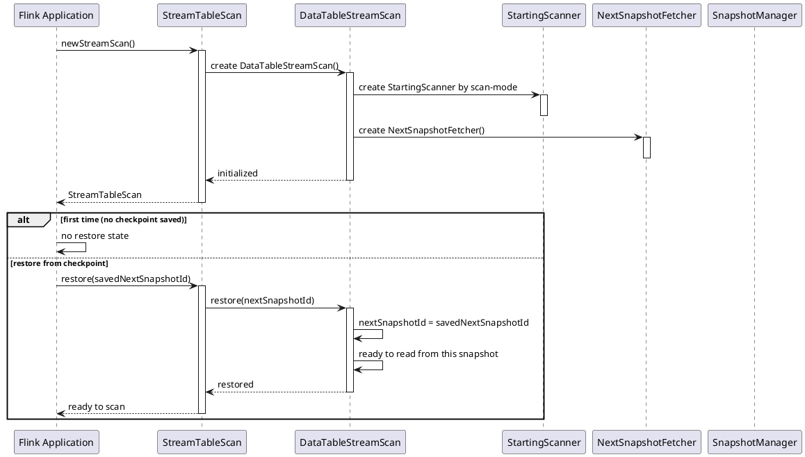
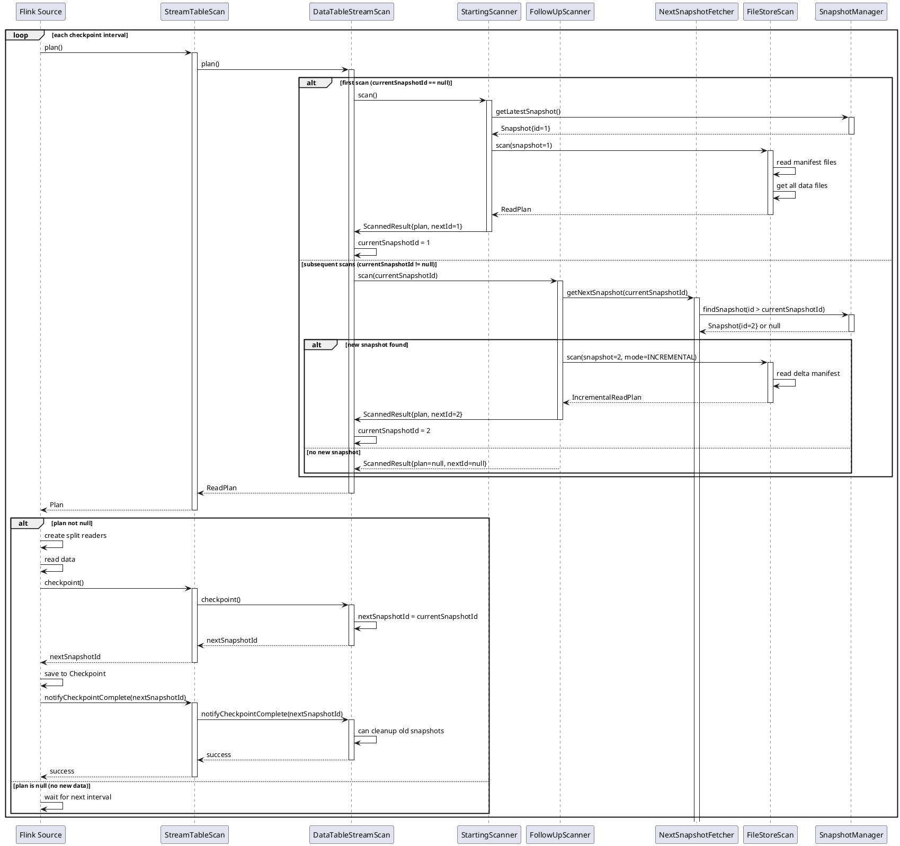
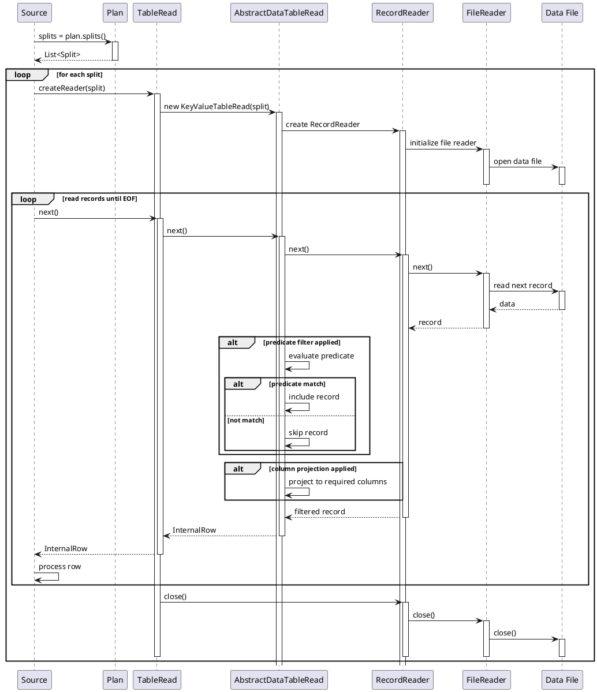
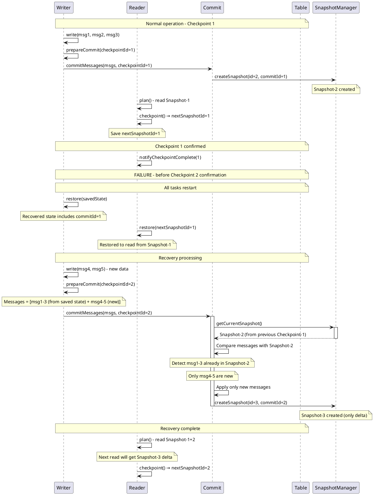
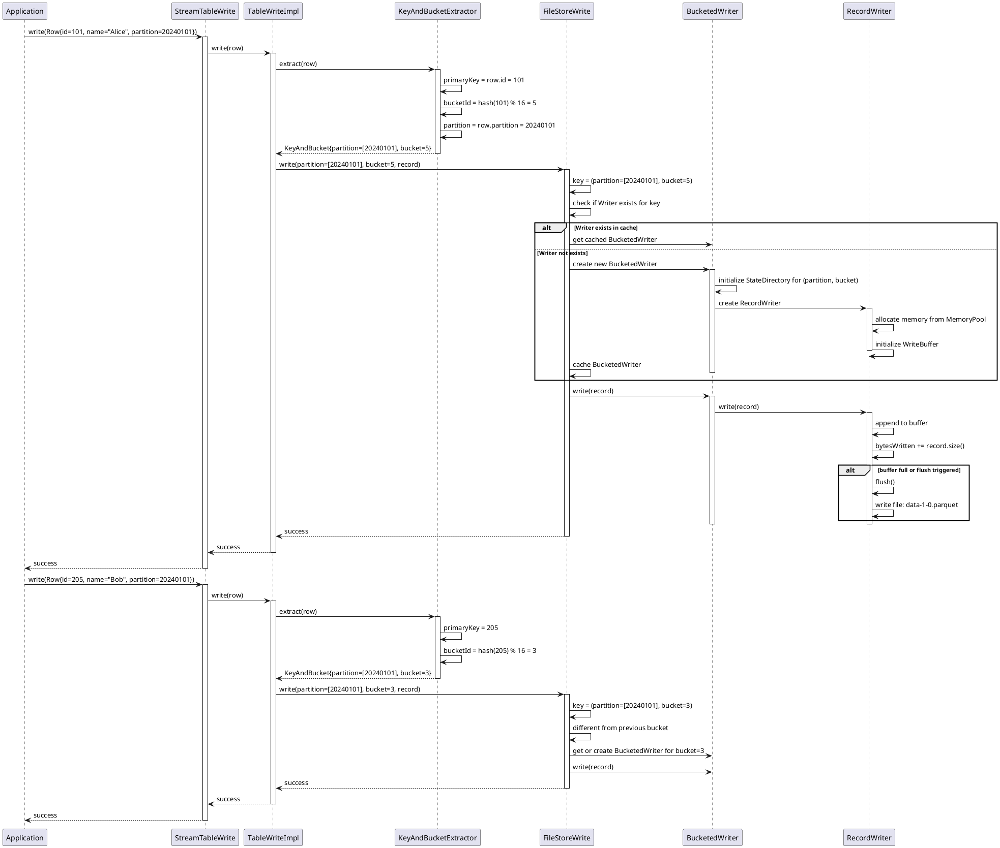
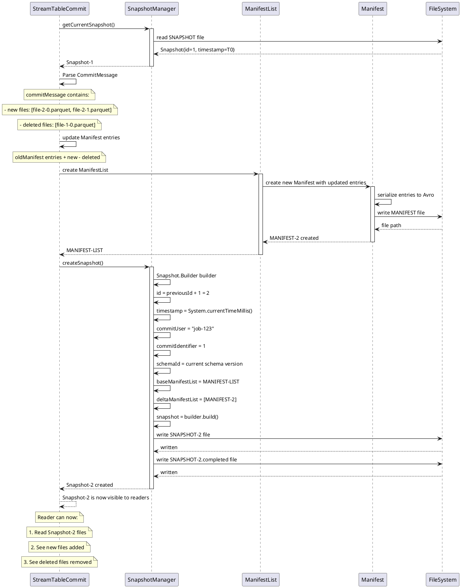
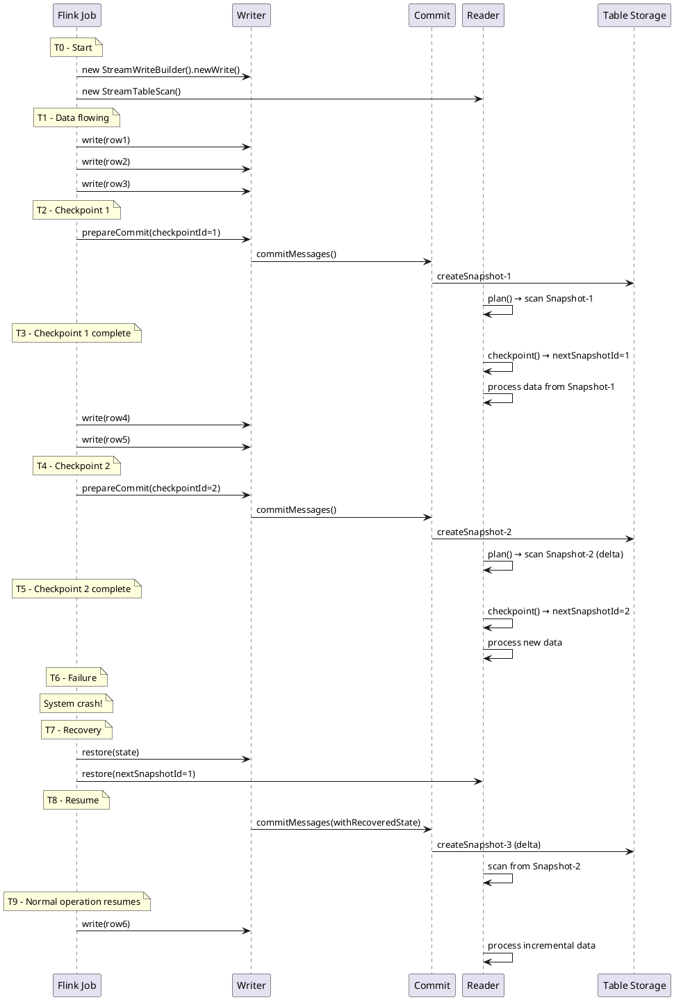

# Paimon 流读流写 - PlantUML 时序图

本文档包含 PlantUML 格式的时序图，可在 PlantUML 编辑器中查看。

## 1. 流写初始化时序图

## 2. 单行数据写入时序图

## 3. Checkpoint 提交时序图

## 4. 流读初始化与恢复时序图

## 5. 流读单次扫描循环时序图

## 6. 数据读取时序图

## 7. 故障恢复与重复检测时序图

## 8. 写入端分桶分配时序图

## 9. 快照创建与验证时序图

## 10. 完整端到端时序（简化版）

---

## 使用说明

1. 将上述 PlantUML 代码复制到 [PlantUML 在线编辑器](http://www.plantuml.com/plantuml/uml/)
2. 或安装本地 PlantUML 工具生成 PNG/SVG 图像
3. 推荐使用 VS Code 的 PlantUML 插件进行实时预览

## 关键概念速查

### 关键参数
- **commitIdentifier**: Checkpoint ID，用于标识每次提交
- **commitUser**: 应用 ID，用于标识流式应用
- **snapshotId**: 快照 ID，用于追踪表的版本
- **bucket**: 分桶 ID，用于数据分布

### 关键方法
- **prepareCommit(waitCompaction, commitIdentifier)**: 准备提交
- **commit(messages, commitIdentifier)**: 应用提交
- **checkpoint()**: 保存读取进度
- **restore(nextSnapshotId)**: 恢复读取进度
- **notifyCheckpointComplete()**: 清理过期数据

### 故障恢复
1. Writer 保存 state（包含 commitIdentifier）
2. Reader 保存 nextSnapshotId
3. 恢复后，根据 commitIdentifier 过滤重复消息
4. 根据 nextSnapshotId 继续读取

